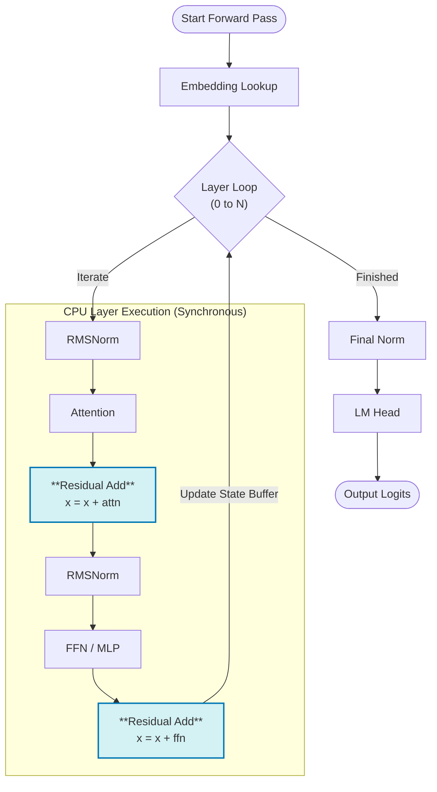
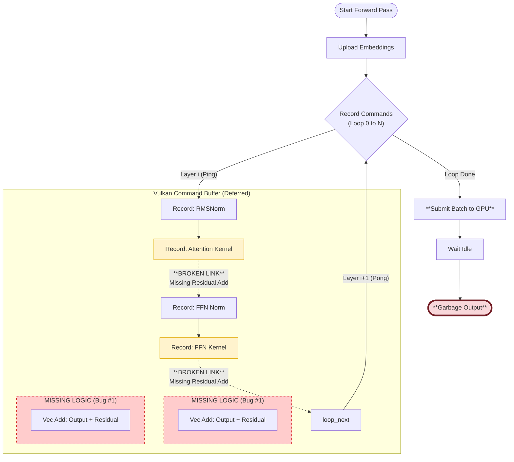

## CPU

```mermaid
flowchart TD
    start([Start Forward Pass]) --> embed[Embedding Lookup]
    embed --> loop_start{"Layer Loop <br/>(0 to N)"}
    
    subgraph CPU_Layer ["CPU Layer Execution (Synchronous)"]
        direction TB
        norm1[RMSNorm] --> attn[Attention]
        attn --> resid1[**Residual Add** <br/>x = x + attn]
        resid1 --> norm2[RMSNorm]
        norm2 --> ffn[FFN / MLP]
        ffn --> resid2[**Residual Add** <br/>x = x + ffn]
    end
    
    loop_start -- "Iterate" --> norm1
    resid2 -- "Update State Buffer" --> loop_start
    
    loop_start -- "Finished" --> final_norm[Final Norm]
    final_norm --> lm_head[LM Head]
    lm_head --> stop([Output Logits])

    style resid1 fill:#d4f1f4,stroke:#0077b6,stroke-width:2px
    style resid2 fill:#d4f1f4,stroke:#0077b6,stroke-width:2px
```

## Vulkan

```mermaid
flowchart TD
    start([Start Forward Pass]) --> upload[Upload Embeddings]
    upload --> record_start{"Record Commands <br/>(Loop 0 to N)"}
    
    subgraph Vulkan_Cmd_Buffer ["Vulkan Command Buffer (Deferred)"]
        direction TB
        rec_norm1[Record: RMSNorm] --> rec_attn[Record: Attention Kernel]
        
        rec_attn -.->|**BROKEN LINK**<br/>Missing Residual Add| next_step
        
        subgraph Missing_Logic ["MISSING LOGIC (Bug #1)"]
            style Missing_Logic fill:#ffcccc,stroke:#cc0000,stroke-dasharray: 5 5
            missing_add1[Vec Add: Output + Residual]
        end
        
        next_step[Record: FFN Norm] --> rec_ffn[Record: FFN Kernel]
        
        rec_ffn -.->|**BROKEN LINK**<br/>Missing Residual Add| loop_next
        
        subgraph Missing_Logic_2 ["MISSING LOGIC (Bug #1)"]
            style Missing_Logic_2 fill:#ffcccc,stroke:#cc0000,stroke-dasharray: 5 5
            missing_add2[Vec Add: Output + Residual]
        end
    end

    record_start -- "Layer i (Ping)" --> rec_norm1
    loop_next -- "Layer i+1 (Pong)" --> record_start
    
    record_start -- "Loop Done" --> submit[**Submit Batch to GPU**]
    submit --> wait[Wait Idle]
    wait --> garbage([**Garbage Output**])

    style rec_attn fill:#fff3cd,stroke:#e0a800
    style rec_ffn fill:#fff3cd,stroke:#e0a800
    style garbage fill:#f8d7da,stroke:#721c24,stroke-width:4px
```